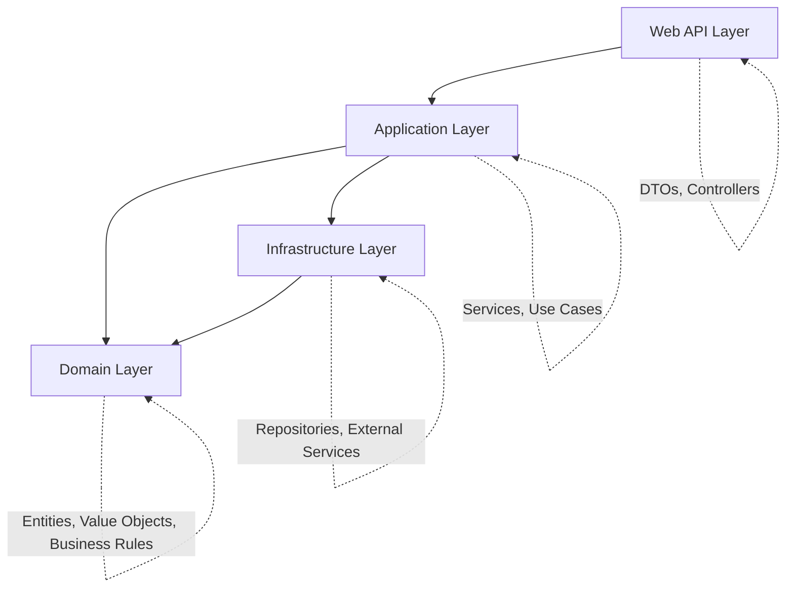
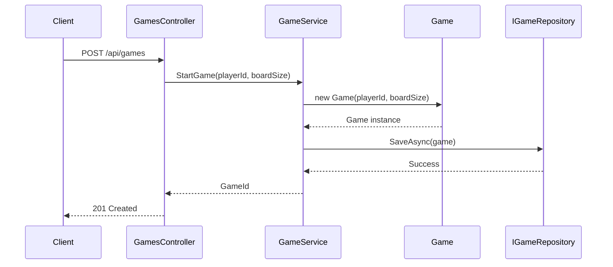
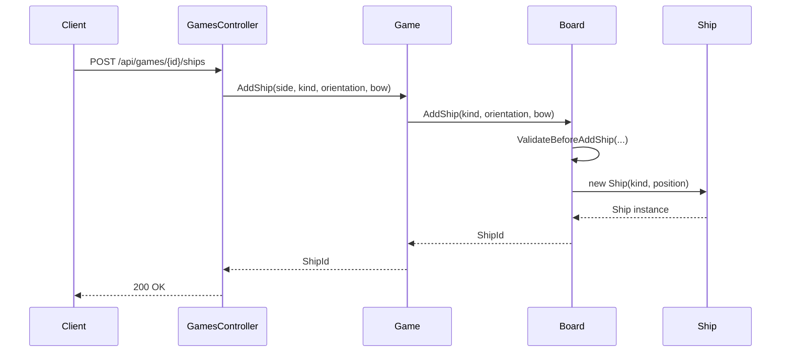

# Battleship Game - Architecture Overview

## Executive Summary

The Battleship Game is a web-based implementation of the classic naval strategy game, built using **Clean Architecture** principles with **Domain-Driven Design (DDD)** patterns. The system is designed to be maintainable, testable, and extensible.

## Technology Stack

### Backend
- **.NET 8.0**: Latest LTS version of .NET
- **ASP.NET Core**: Web API framework
- **C# 12**: Modern C# features with nullable reference types
- **Swagger/OpenAPI**: API documentation and testing

### Testing
- **xUnit**: Primary testing framework
- **FluentAssertions**: Readable test assertions
- **FakeItEasy**: Mocking framework (planned)

### Development Tools
- **CSharpier**: Code formatting
- **Docker**: Containerization support
- **Visual Studio/Rider**: IDE support

## Architectural Principles

### Clean Architecture
The system follows Uncle Bob's Clean Architecture pattern with clear separation of concerns:



### Domain-Driven Design (DDD)
- **Ubiquitous Language**: Consistent terminology across code and business
- **Bounded Contexts**: Clear boundaries around related concepts
- **Aggregates**: Consistency boundaries with aggregate roots
- **Value Objects**: Immutable objects without identity
- **Domain Events**: Decoupled communication pattern

### SOLID Principles
- **Single Responsibility**: Each class has one reason to change
- **Open/Closed**: Open for extension, closed for modification
- **Liskov Substitution**: Derived classes must be substitutable
- **Interface Segregation**: Many specific interfaces vs. one general
- **Dependency Inversion**: Depend on abstractions, not concretions

## Layer Responsibilities

### 1. Domain Layer (`BattleshipGame/Domain`)
**Purpose**: Contains the core business logic and domain model.

**Components**:
- **Entities**: `Game`, `Board`, `Ship` (with identity and lifecycle)
- **Value Objects**: `Cell`, strongly-typed IDs (immutable objects)
- **Aggregates**: `GameAggregate`, `PlayerAggregate` (consistency boundaries)
- **Domain Events**: Event-driven communication via `IDomainEvent`, `DomainEvent<T>` base classes
- **Business Rules**: Game logic, validation, and constraints

**Domain Events Implemented**:
- `CellAttackedEvent`: Raised when a cell is attacked
- `GameOverEvent`: Raised when game concludes
- `ShipSunkEvent`: Raised when a ship is destroyed
- `BoardsReadyEvent`: Raised when both boards are ready for gameplay
- `PlayerJoinedGameEvent`: Raised when player joins game
- `PlayerLeftGameEvent`: Raised when player leaves game

**Dependencies**: None (pure domain logic)

### 2. Application Layer (`BattleshipGame/Application`)
**Purpose**: Orchestrates domain objects to fulfill use cases using CQRS pattern.

**Components**:
- **Application Services**:
  - `IGameplayService`, `GameplayService` - Orchestrates game lifecycle
  - `IPlayerService`, `PlayerService` - Manages player operations
- **Commands**: `CreateGameCommand`, `PlaceShipCommand`, `AttackCommand` (handlers via MediatR)
- **Queries**: `GetGameQuery`, `GetPlayerQuery`, `GetPlayerByUsernameQuery` (handlers via MediatR)
- **DTOs**: Data transfer objects for inter-layer communication (`GetGameQueryResult`, `GetPlayerQueryResult`)
- **Repository Contracts**: `IGameRepository`, `IPlayerRepository` (abstraction for persistence)
- **Domain Event Dispatcher**: `IDomainEventDispatcher` - Publishes domain events through MediatR

**Event Dispatch Pattern**:
- Domain events are raised within aggregate roots using `AddDomainEvent()`
- `DomainEventDispatcher` publishes events to MediatR for decoupled handling
- Event handlers can implement cross-cutting concerns (notifications, logging, etc.)
- Aggregates maintain `IReadOnlyList<IDomainEvent>` of pending events

**Dependencies**: Domain Layer only

### 3. Infrastructure Layer (`BattleshipGame/Infrastructure`)
**Purpose**: Implements external concerns and data persistence.

**Components**:
- **Repositories** (currently in-memory):
  - `InMemoryGameRepository`: Implements `IGameRepository` for game persistence
  - `InMemoryPlayerRepository`: Implements `IPlayerRepository` for player persistence
  - Methods: `GetByIdAsync()`, `SaveAsync()`, `DeleteAsync()`, `GetAllAsync()`, `UsernameExistsAsync()`
- **Data Access** (planned): Entity Framework Core DbContext for database integration
- **External Services** (planned): Authentication, logging, notifications
- **Adapters**: Third-party integrations

**Repository Pattern Benefits**:
- Abstracts data access details from application layer
- Enables easy switching between in-memory and persistent storage
- Facilitates testing through mock implementations
- Provides consistent data access interface

**Dependencies**: Domain Layer, Application Layer

### 4. Presentation Layer (`BattleshipGame.WebAPI`)
**Purpose**: Handles HTTP requests and responses.

**Components**:
- **Controllers**: `GamesController` (REST API endpoints)
- **DTOs**: Request/response models
- **Middleware**: Error handling, logging, CORS
- **Configuration**: Dependency injection, Swagger setup

**Dependencies**: Application Layer, Infrastructure Layer

## Key Design Patterns

### Repository Pattern
Abstracts data access to enable testability and flexibility:
```csharp
public interface IGameRepository
{
    Task<Game?> GetByIdAsync(GameId id);
    Task SaveAsync(Game game);
    Task DeleteAsync(GameId id);
    Task<IEnumerable<Game>> GetAllAsync();
}

public interface IPlayerRepository
{
    Task<Player?> GetByIdAsync(PlayerId id);
    Task<PlayerId> SaveAsync(Player player);
    Task<Player?> GetByUsernameAsync(string username);
    Task<bool> UsernameExistsAsync(string username);
}
```

### Aggregate Pattern
Maintains consistency boundaries and encapsulates business rules:
```csharp
public sealed class Game : AggregateRoot<GameId>
{
    // Encapsulates game rules and state
    // Controls access to internal entities (Board, Ship)
    // Ensures invariants are maintained
}
```

### Strongly-Typed IDs
Prevents primitive obsession and improves type safety:
```csharp
public record GameId(Guid Value) : EntityId(Value);
public record ShipId(Guid Value) : EntityId(Value);
```

### Domain Events Pattern
Enables loose coupling and cross-cutting concerns:
```csharp
public abstract class DomainEvent<T> : IDomainEvent
    where T : class
{
    public Guid EventId { get; init; } = Guid.NewGuid();
    public DateTime OccurredOn { get; init; } = DateTime.UtcNow;
    public Type EventType { get; init; } = typeof(T);
}
```

**Event Flow**:
1. Aggregate raises domain event: `AddDomainEvent(new CellAttackedEvent(...))`
2. Event is stored in aggregate's `DomainEvents` collection
3. Application layer dispatches events: `await eventDispatcher.DispatchEventsAsync(aggregate)`
4. `DomainEventDispatcher` publishes each event through MediatR
5. MediatR routes events to corresponding event handlers
6. Handlers implement side effects (logging, notifications, state updates)
7. Aggregate clears events: `aggregate.ClearDomainEvents()`

**Benefits**:
- Decouples domain from application concerns
- Enables audit trail and event replay capabilities
- Supports event sourcing (future enhancement)
- Clean separation of core logic from side effects

## Data Flow

### Game Creation Flow


### Ship Placement Flow


## Error Handling Strategy

### Domain Layer
- Throws `ArgumentException` for invalid inputs
- Throws `ApplicationException` for business rule violations
- Uses centralized `ErrorMessages` class for consistency

### Application Layer
- Catches domain exceptions and translates to appropriate responses
- Validates inputs before calling domain methods
- Logs errors for debugging and monitoring

### API Layer
- Returns appropriate HTTP status codes (200, 201, 400, 404, 500)
- Uses Problem Details format for error responses
- Implements global exception handling middleware

## Testing Strategy

### Unit Testing
- **Domain Layer**: Comprehensive coverage of business rules
- **Application Layer**: Service behavior and integration testing
- **API Layer**: Controller behavior and response validation

### Integration Testing
- Database integration tests
- API endpoint testing
- Cross-layer integration validation

### Test Patterns
- **Arrange-Act-Assert**: Clear test structure
- **Test Data Builders**: Consistent test data creation
- **Mock Dependencies**: Isolated unit testing

## Performance Considerations

### Memory Management
- Use of value objects for immutable data
- Efficient collections (HashSet, Dictionary)
- Proper disposal of resources

### Scalability
- Stateless API design
- Repository pattern for data access optimization
- Caching strategies (future enhancement)

## Security Considerations

### API Security
- Input validation at multiple layers
- SQL injection prevention through parameterized queries
- CORS configuration for web clients

### Business Logic Security
- Domain-driven validation rules
- Aggregate boundaries prevent invalid state
- Immutable value objects prevent tampering

## Deployment Architecture

### Development
- Local development with file-based storage
- Docker support for consistent environments
- Swagger UI for API testing

### Production (Planned)
- Container orchestration (Kubernetes/Docker Swarm)
- Database persistence (SQL Server/PostgreSQL)
- Load balancing and scaling
- Monitoring and logging integration

## Future Enhancements

### Technical Improvements
- **MediatR**: CQRS pattern implementation
- **FluentValidation**: Enhanced input validation
- **Entity Framework Core**: Data persistence
- **Serilog**: Structured logging
- **JWT Authentication**: User security

### Feature Enhancements
- **Multiplayer Support**: Real-time gameplay
- **AI Opponents**: Computer player implementation
- **Game Statistics**: Player performance tracking
- **Tournament Mode**: Multi-game competitions

## Conclusion

The Battleship Game architecture provides a solid foundation for a maintainable, testable, and extensible system. The Clean Architecture and DDD patterns ensure that business logic remains at the center, while technical concerns are properly separated and abstracted. This design supports both current requirements and future enhancements while maintaining code quality and developer productivity.
