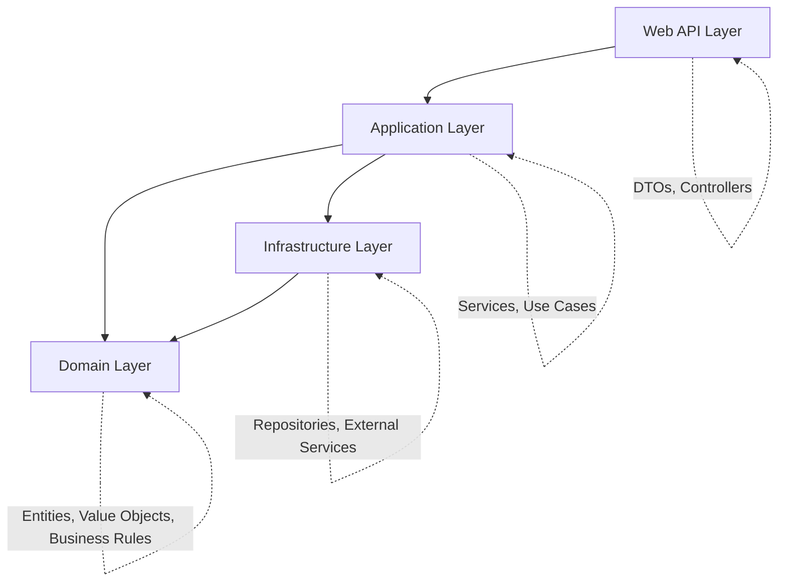
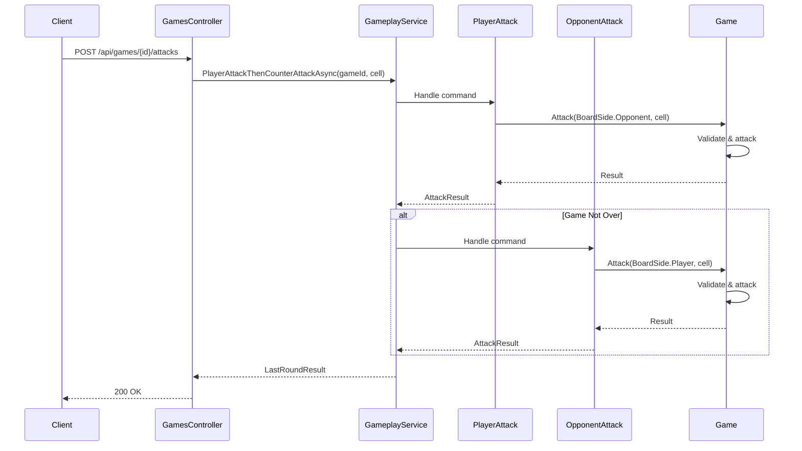
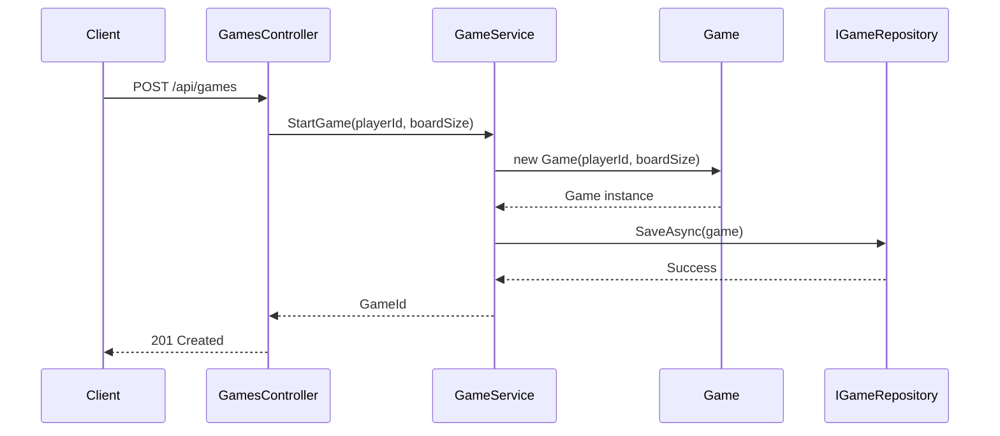
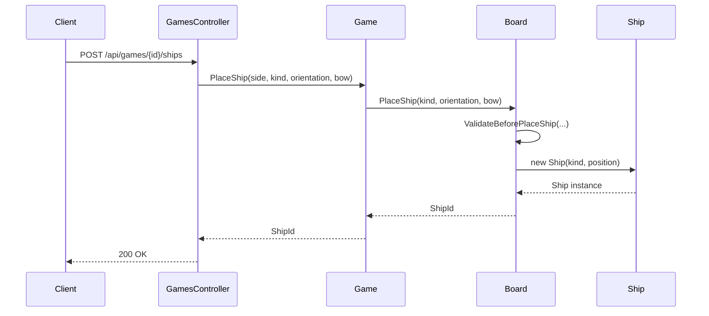

# Battleship Game - Architecture Overview

## Executive Summary

The Battleship Game is a web-based implementation of the classic naval strategy game, built using **Clean Architecture** principles with **Domain-Driven Design (DDD)** patterns. The system is designed to be maintainable, testable, and extensible.

## Technology Stack

### Backend
- **.NET 8.0**: Latest LTS version of .NET
- **ASP.NET Core**: Web API framework
- **C# 12**: Modern C# features with nullable reference types
- **Swagger/OpenAPI**: API documentation and testing

### Testing
- **xUnit**: Primary testing framework
- **FluentAssertions**: Readable test assertions
- **FakeItEasy**: Mocking framework (planned)

### Development Tools
- **CSharpier**: Code formatting
- **Docker**: Containerization support
- **Visual Studio/Rider**: IDE support

## Architectural Principles

### Clean Architecture
The system follows Uncle Bob's Clean Architecture pattern with clear separation of concerns:


```mermaid
graph TB
    UI[Web API Layer] --> App[Application Layer]
    App --> Domain[Domain Layer]
    App --> Infra[Infrastructure Layer]
    Infra --> Domain

    UI -.-> |"DTOs, Controllers"| UI
    App -.-> |"Services, Use Cases"| App
    Domain -.-> |"Entities, Value Objects, Business Rules"| Domain
    Infra -.-> |"Repositories, External Services"| Infra
```

### Domain-Driven Design (DDD)
- **Ubiquitous Language**: Consistent terminology across code and business
- **Bounded Contexts**: Clear boundaries around related concepts
- **Aggregates**: Consistency boundaries with aggregate roots
- **Value Objects**: Immutable objects without identity
- **Domain Events**: Decoupled communication pattern

### SOLID Principles
- **Single Responsibility**: Each class has one reason to change
- **Open/Closed**: Open for extension, closed for modification
- **Liskov Substitution**: Derived classes must be substitutable
- **Interface Segregation**: Many specific interfaces vs. one general
- **Dependency Inversion**: Depend on abstractions, not concretions

## Layer Responsibilities

### 1. Domain Layer (`BattleshipGame/Domain`)
**Purpose**: Contains the core business logic and domain model.

**Components**:
- **Entities**: `Game`, `Board`, `Ship` (with identity and lifecycle)
- **Value Objects**: `Cell`, strongly-typed IDs (immutable objects)
- **Aggregates**: `GameAggregate`, `PlayerAggregate` (consistency boundaries)
- **Domain Events**: Event-driven communication via `IDomainEvent`, `DomainEvent<T>` base classes
- **Business Rules**: Game logic, validation, and constraints

**Domain Events Implemented**:
- `CellAttackedEvent`: Raised when a cell is attacked
- `GameOverEvent`: Raised when game concludes
- `ShipSunkEvent`: Raised when a ship is destroyed
- `BoardsReadyEvent`: Raised when both boards are ready for gameplay
- `PlayerJoinedGameEvent`: Raised when player joins game
- `PlayerLeftGameEvent`: Raised when player leaves game

**Dependencies**: None (pure domain logic)

### 2. Application Layer (`BattleshipGame/Application`)
**Purpose**: Orchestrates domain objects to fulfill use cases using CQRS pattern.

**Components**:
- **Application Services**:
  - `IGameplayService`, `GameplayService` - Orchestrates game lifecycle
  - `IPlayerService`, `PlayerService` - Manages player operations
- **Commands**: `CreateGameCommand`, `PlaceShipCommand`, `PlayerAttackCommand`, `OpponentAttackCommand` (handlers via MediatR)
- **Queries**: `GetGameQuery`, `GetPlayerQuery`, `GetPlayerByUsernameQuery` (handlers via MediatR)
- **DTOs**: Data transfer objects for inter-layer communication (`GetGameQueryResult`, `GetPlayerQueryResult`)
- **Result Types**: Rich result objects from commands (`AttackResult`, `LastRoundResult`)
- **Repository Contracts**: `IGameRepository`, `IPlayerRepository` (abstraction for persistence)
- **Domain Event Dispatcher**: `IDomainEventDispatcher` - Publishes domain events through MediatR

**CQRS Command Pattern**:
- Commands return rich result objects containing mutation outcomes (CQRS-compliant)
- `AttackResult` contains attack details: `TargetCell`, `CellState`, `GameState`, `WinnerSide`, `SunkShip`, `ShipSize`
- `LastRoundResult` contains complete round outcome: both player and opponent attack details
- Commands eliminate need for follow-up queries (e.g., removed `CheckGameStatusCommand`)
- Results are constructed from domain events and aggregate state in command handlers

**Event Dispatch Pattern**:
- Domain events are raised within aggregate roots using `AddDomainEvent()`
- `DomainEventDispatcher` publishes events to MediatR for decoupled handling
- Event handlers can implement cross-cutting concerns (notifications, logging, etc.)
- Aggregates maintain `IReadOnlyList<IDomainEvent>` of pending events

**Opponent Contracts**:
- `IComputerOpponent`: Strategy interface for AI attack selection (always targets Player's board)
- `IComputerOpponentFactory`: Factory for per-game strategy resolution
- `IPromptBuilder`: LLM prompt construction for SemanticKernel strategy
- `GameStateContext`: Read-only projection for AI decision-making (built by strategy internally)

**Dependencies**: Domain Layer only

### 3. Infrastructure Layer (`BattleshipGame/Infrastructure`)
**Purpose**: Implements external concerns and data persistence.

**Components**:
- **Repositories** (EF Core + PostgreSQL):
  - `GameRepository`: Implements `IGameRepository` over `BattleshipGameDbContext`
  - `PlayerRepository`: Implements `IPlayerRepository` over `BattleshipGameDbContext`
  - See the **Persistence (EF Core + PostgreSQL)** section below for the data model
- **Opponent Strategies**:
  - `RandomAttackStrategy`: Random cell selection from available targets on Player's board
  - `SemanticKernelStrategy`: LLM-based strategic attack selection using Semantic Kernel
  - `OpponentStrategyFactory`: Factory resolving strategies via keyed DI services
  - `BattleshipPromptBuilder`: Constructs prompts for LLM-based strategies
- **Data Access**: `BattleshipGameDbContext` (EF Core 10 + Npgsql) with entity configurations and migrations
- **External Services**: Semantic Kernel integration for AI/LLM features
- **Adapters**: Third-party integrations

**Repository Pattern Benefits**:
- Abstracts data access details from application layer
- Enables easy switching between in-memory and persistent storage
- Facilitates testing through mock implementations
- Provides consistent data access interface

**Dependencies**: Domain Layer, Application Layer

### 4. Presentation Layer (`BattleshipGame.WebAPI`)
**Purpose**: Handles HTTP requests and responses.

**Components**:
- **Controllers**: `GamesController` (REST API endpoints)
- **DTOs**: Request/response models
- **Middleware**: Error handling, logging, CORS
- **Configuration**: Dependency injection, Swagger setup

**Dependencies**: Application Layer, Infrastructure Layer

## Key Design Patterns

### Repository Pattern
Abstracts data access to enable testability and flexibility:
```csharp
public interface IGameRepository
{
    Task<Game?> GetByIdAsync(GameId gameId, CancellationToken ct);
    Task<Game> GetByIdOrThrowAsync(GameId gameId, CancellationToken ct);
    Task SaveAsync(Game game, CancellationToken ct);
    Task<IReadOnlyCollection<Game>> GetByPlayerIdAsync(PlayerId playerId, CancellationToken ct);
    Task<Game?> GetActiveGameByPlayerIdAsync(PlayerId playerId, CancellationToken ct);
}

public interface IPlayerRepository
{
    Task<Player?> GetByIdAsync(PlayerId playerId, CancellationToken ct);
    Task<PlayerId> SaveAsync(Player player, CancellationToken ct);
    Task<Player?> GetByUsernameAsync(string username, CancellationToken ct);
    Task<bool> UsernameExistsAsync(string username, CancellationToken ct);
}
```

### Aggregate Pattern
Maintains consistency boundaries and encapsulates business rules:
```csharp
public sealed class Game : AggregateRoot<GameId>
{
    // Encapsulates game rules and state
    // Controls access to internal entities (Board, Ship)
    // Ensures invariants are maintained
}
```

### Strongly-Typed IDs
Prevents primitive obsession and improves type safety:
```csharp
public record GameId(Guid Value) : EntityId(Value);
public record ShipId(Guid Value) : EntityId(Value);
```

### Domain Events Pattern
Enables loose coupling and cross-cutting concerns:
```csharp
public abstract class DomainEvent<T> : IDomainEvent
    where T : class
{
    public Guid EventId { get; init; } = Guid.NewGuid();
    public DateTime OccurredOn { get; init; } = DateTime.UtcNow;
    public Type EventType { get; init; } = typeof(T);
}
```

**Event Flow**:
1. Aggregate raises domain event: `AddDomainEvent(new ShipSunkEvent(...))`
2. Event is stored in aggregate's `DomainEvents` collection
3. Application layer dispatches events: `await eventDispatcher.DispatchEventsAsync(aggregate)`
4. `DomainEventDispatcher` publishes each event through MediatR
5. MediatR routes events to corresponding event handlers
6. Handlers implement side effects (logging, notifications, state updates)
7. Aggregate clears events: `aggregate.ClearDomainEvents()`

**Benefits**:
- Decouples domain from application concerns
- Enables audit trail and event replay capabilities
- Supports event sourcing (future enhancement)
- Clean separation of core logic from side effects

**Command Return Values**:
- Commands can return mutation outcomes without violating CQRS principles
- Return values represent **what changed**, not queries of current state
- Example: `AttackResult` returns attack outcome (hit/miss), sunk ship info, and game state changes
- Eliminates need for follow-up queries (better performance, simpler code)
- Pattern: Command executes → Domain events raised → Result built from events and aggregate state

## Data Flow

### Game Attack Flow (Player Attack + Counter-Attack)

```mermaid
sequenceDiagram
    participant Client
    participant API as GamesController
    participant Service as GameplayService
    participant PlayerCmd as PlayerAttack
    participant OpponentCmd as OpponentAttack
    participant Domain as Game

    Client->>API: POST /api/games/{id}/attacks
    API->>Service: PlayerAttackThenCounterAttackAsync(gameId, cell)
    Service->>PlayerCmd: Handle command
    PlayerCmd->>Domain: Attack(BoardSide.Opponent, cell)
    Domain->>Domain: Validate & attack
    Domain-->>PlayerCmd: Result
    PlayerCmd-->>Service: AttackResult
    
    alt Game Not Over
        Service->>OpponentCmd: Handle command
        OpponentCmd->>Domain: Attack(BoardSide.Player, cell)
        Domain->>Domain: Validate & attack
        Domain-->>OpponentCmd: Result
        OpponentCmd-->>Service: AttackResult
    end
    
    Service-->>API: LastRoundResult
    API-->>Client: 200 OK
```

### Game Creation Flow

```mermaid
sequenceDiagram
    participant Client
    participant API as GamesController
    participant Service as GameService
    participant Domain as Game
    participant Repo as IGameRepository

    Client->>API: POST /api/games
    API->>Service: StartGame(playerId, boardSize)
    Service->>Domain: new Game(playerId, boardSize)
    Domain-->>Service: Game instance
    Service->>Repo: SaveAsync(game)
    Repo-->>Service: Success
    Service-->>API: GameId
    API-->>Client: 201 Created
```

### Ship Placement Flow

```mermaid
sequenceDiagram
    participant Client
    participant API as GamesController
    participant Domain as Game
    participant Board
    participant Ship

    Client->>API: POST /api/games/{id}/ships
    API->>Domain: PlaceShip(side, kind, orientation, bow)
    Domain->>Board: PlaceShip(kind, orientation, bow)
    Board->>Board: ValidateBeforePlaceShip(...)
    Board->>Ship: new Ship(kind, position)
    Ship-->>Board: Ship instance
    Board-->>Domain: ShipId
    Domain-->>API: ShipId
    API-->>Client: 200 OK
```

## Persistence (EF Core + PostgreSQL)

Persistence is implemented with **Entity Framework Core 10** on **PostgreSQL** (Npgsql), living entirely in the Infrastructure layer. The Domain and Application layers depend only on the `IGameRepository` / `IPlayerRepository` contracts and stay persistence-agnostic.

### DbContext and tables

`BattleshipGameDbContext` exposes **internal** `DbSet`s (only the repositories touch them) and applies all `IEntityTypeConfiguration` types from the assembly. There are three tables:

| Aggregate / entity | Table | Notes |
|---|---|---|
| `PlayerEntity` | `players` | Unique index on `username`; filtered unique index on `active_game_id` |
| `PlayerGameHistoryEntry` | `player_game_history` | Child of player (FK `player_id`, cascade delete) |
| `GameEntity` | `games` | Owns both boards as JSON (see below) |

There are **no separate Board / Cell / Ship tables**. Each `GameEntity` owns two boards (`OwnBoard`, `OppBoard`) mapped with `.ToJson()` into the `own_board` / `opp_board` `jsonb` columns; each board in turn owns its `Cells` and `Ships` collections, serialized inside that same JSON document. EF assigns a synthetic ordinal (`__synthesizedOrdinal`) as the key of these JSON-owned collection elements.

### Mapping choices

- **Strongly-typed IDs** (`GameId`, `PlayerId`) are stored as raw `Guid` columns; conversion to/from the domain types happens in the repositories' mapping methods (`MapToDomain` / `MapToEntity`), so no EF concerns leak into the Domain.
- **Enums** (`State`, `OpponentStrategy`, board sides) are stored as `int`.
- **Optimistic concurrency**: both `players` and `games` use PostgreSQL's system `xmin` column as a row-version concurrency token (`IsRowVersion()`). A writer that loses a concurrent-update race gets a `DbUpdateConcurrencyException`.
- Columns use `snake_case` names.

### Unit of work

Repositories **stage** changes (add or mutate tracked entities) but do not call `SaveChanges` themselves. The MediatR `UnitOfWorkBehavior` commits the `DbContext` once per request, so a command that touches multiple aggregates (e.g. `StartNewGame`, which saves both a `Game` and a `Player`) is persisted atomically.

### Migrations and local run

- Migrations live in `src/BattleshipGame.Infrastructure/Persistence/Migrations`.
- A dedicated `BattleshipGame.MigrationRunner` console project applies migrations.
- The Aspire AppHost provisions PostgreSQL, runs the MigrationRunner, and starts the Web API only after migrations complete (`WaitForCompletion`). See [local-dev.md](local-dev.md).

DI wiring (`AddInfrastructureServices`) registers `AddDbContext<BattleshipGameDbContext>` with `UseNpgsql(...)` against the `battleship` connection string, plus scoped `IGameRepository`, `IPlayerRepository`, and `IUnitOfWork`.

## Error Handling Strategy

### Domain Layer
- Throws `ArgumentException` for invalid inputs
- Throws `ApplicationException` for business rule violations
- Uses centralized `ErrorMessages` class for consistency

### Application Layer
- Catches domain exceptions and translates to appropriate responses
- Validates inputs before calling domain methods
- Logs errors for debugging and monitoring

### API Layer
- Returns appropriate HTTP status codes (200, 201, 400, 404, 500)
- Uses Problem Details format for error responses
- Implements global exception handling middleware

## Testing Strategy

### Unit Testing
- **Domain Layer**: Comprehensive coverage of business rules
- **Application Layer**: Service behavior and integration testing
- **API Layer**: Controller behavior and response validation

### Integration Testing
- Database integration tests
- API endpoint testing
- Cross-layer integration validation

### Test Patterns
- **Arrange-Act-Assert**: Clear test structure
- **Test Data Builders**: Consistent test data creation
- **Mock Dependencies**: Isolated unit testing

## Performance Considerations

### Memory Management
- Use of value objects for immutable data
- Efficient collections (HashSet, Dictionary)
- Proper disposal of resources

### Scalability
- Stateless API design
- Repository pattern for data access optimization
- Caching strategies (future enhancement)

## Security Considerations

### API Security
- Input validation at multiple layers
- SQL injection prevention through parameterized queries
- CORS configuration for web clients

### Business Logic Security
- Domain-driven validation rules
- Aggregate boundaries prevent invalid state
- Immutable value objects prevent tampering

## Deployment Architecture

### Development
- Local development with file-based storage
- Docker support for consistent environments
- Swagger UI for API testing

### Production (Planned)
- Container orchestration (Kubernetes/Docker Swarm)
- Database persistence (SQL Server/PostgreSQL)
- Load balancing and scaling
- Monitoring and logging integration

## Future Enhancements

### Technical Improvements
- **MediatR**: CQRS pattern implementation ✅ Implemented
- **FluentValidation**: Enhanced input validation
- **Entity Framework Core**: Data persistence
- **Serilog**: Structured logging
- **JWT Authentication**: User security

### Feature Enhancements
- **Multiplayer Support**: Real-time gameplay
- **AI Opponents**: Computer player implementation ✅ Implemented (Random + Semantic Kernel strategies)
- **Game Statistics**: Player performance tracking
- **Tournament Mode**: Multi-game competitions

### Opponent Architecture (Implemented)

The AI opponent system follows Clean Architecture principles:

**Application Layer Contracts**:
- `IComputerOpponent`: Defines strategy interface with `SelectNextAttackAsync(Game, CancellationToken)` - always attacks Player's board
- `IComputerOpponentFactory`: Factory pattern for per-game strategy resolution
- `IPromptBuilder`: Abstracts LLM prompt construction
- `GameStateContext`: Simplified read-only record with essential game state (built internally by strategy)

**Infrastructure Implementations**:
- `RandomAttackStrategy`: Simple random cell selection from Player's board
- `SemanticKernelStrategy`: LLM-powered strategic reasoning using Microsoft Semantic Kernel
- `OpponentStrategyFactory`: Uses .NET 8 keyed DI services for strategy resolution
- `BattleshipPromptBuilder`: Constructs strategic prompts for LLM

**Per-Game Strategy Selection**:
- `OpponentStrategy` enum stored on `Game` aggregate (None, Random, SemanticKernel)
- Strategy selected at game creation time via API
- Factory resolves correct strategy based on game configuration

## Conclusion

The Battleship Game architecture provides a solid foundation for a maintainable, testable, and extensible system. The Clean Architecture and DDD patterns ensure that business logic remains at the center, while technical concerns are properly separated and abstracted. This design supports both current requirements and future enhancements while maintaining code quality and developer productivity.
