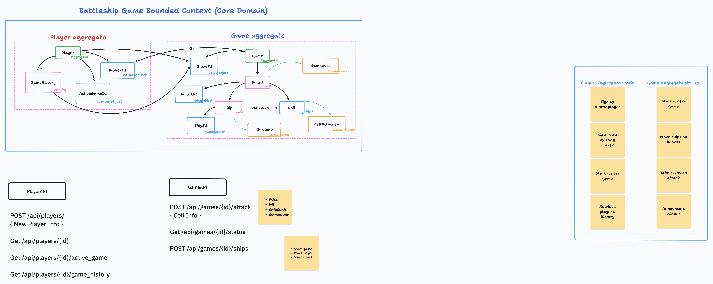

# Battleship Game — Bounded Context Analysis

## Purpose
Provide a concise analysis of the Battleship Game bounded contexts, their responsibilities, boundaries, contracts, and interactions, aligned with the domain diagram.

## Context Map

- **Game Context**
  - Responsibility: Gameplay lifecycle (setup, start, turns, win/lose)
  - Core model: `Game` aggregate with `Board`, `Ship`, `Cell`
  - Events: `GameReady`, `GameStarted`, `UnderAttack`, `ShipSunk`, `GameOver`
  - External contract: Games API — create, place ship, attack (returns `LastRoundResult`), get/update state

- **Player Context**
  - Responsibility: Player identity and game history
  - Core model: `Player` aggregate (`ActiveGameId`, `GameHistory`)
  - Events (reactive): updates on game lifecycle (e.g., record history on `GameOver`)
  - External contract: Players API — create, get by ID, get by username (history endpoint pending)

- **Shared Kernel**
  - Purpose: Common, stable types shared across contexts
  - Types: Strongly-typed IDs (`GameId`, `PlayerId`, `ShipId`), enums (`GameState`, `BoardSide`, `CellState`, `ShipKind`, `ShipOrientation`)
  - Rule: Only pure abstractions and primitives; no business logic

## Boundaries & Ownership

- **Ownership**
  - Game Context owns board/ship state, attack rules, and game state transitions
  - Player Context owns player identity, active game pointer, and history

- **Integration**
  - Domain events are the integration mechanism between contexts
  - Example: `ShipSunk`/`GameOver` raised in Game → Player reacts to update history/statistics

## Contracts (External APIs)

- **Games API** (type-safe enums)
  - `POST /api/games` — create game
  - `GET /api/games/{id}` — retrieve game (includes `GameState`, `WinnerSide`)
  - `POST /api/games/{id}/ships` — place ship (`BoardSide`, `ShipKind`, `ShipOrientation`)
  - `POST /api/games/{id}/attacks` — player attack + counter-attack → returns `LastRoundResult`
  - `PUT /api/games/{id}/state`, `GET /api/games/{id}/state` — update/get state

- **Players API**
  - `POST /api/players` — create player
  - `GET /api/players/{id}` — get player by ID
  - `GET /api/players/{username}` — get player by username
  - (Planned) `GET /api/players/{id}/game_history` — expose history

## Invariants (Per Context)

- **Game Context**
  - Valid transitions: New → Ready → Started → GameOver
  - Attack preconditions: Not GameOver, Started, correct `TargetSide`
  - Board constraints: no overlaps, valid placement, 5 ships limit

- **Player Context**
  - At most one `ActiveGameId`
  - Completed games appended to `GameHistory`

## Interactions

- Commands in Game Context produce domain events; rich results (`AttackResult`, `LastRoundResult`) returned to clients
- Player Context should subscribe to game lifecycle events to maintain history/statistics

## Observations (Alignment)

- Contexts and boundaries match the diagram
- Shared kernel centralizes common types correctly
- Games API fully reflects Game Context contract and returns rich, context-appropriate results
- Players API is implemented (create/get); history exposure is pending

## Next Steps (Context-Focused)

- Expose player game history endpoint to complete Player Context contract
- Add cross-context event handlers (Player reacts to `GameOver`) to keep history/statistics in sync

This analysis focuses on bounded contexts, responsibilities, and contracts. Detailed implementation priorities and tasks live in `technical-debt-and-roadmap.md`.