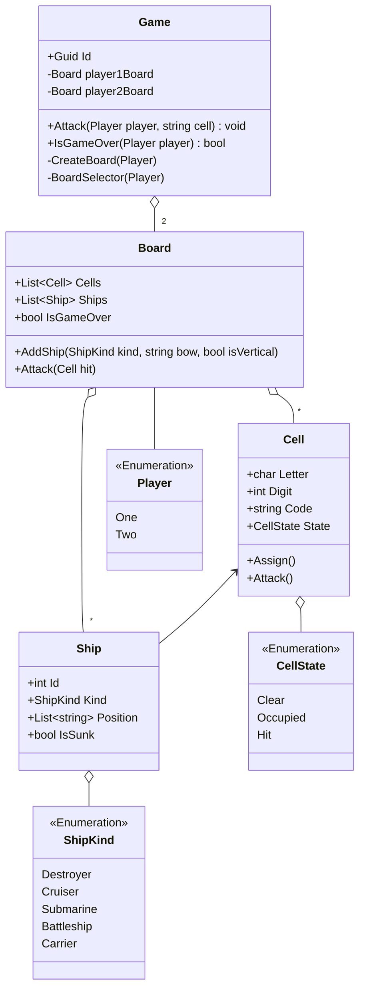

```mermaid
classDiagram
direction TB
	class Game {
		+Guid Id
		-Board player1Board
		-Board player2Board
		+Attack(Player player, string cell) void
		+IsGameOver(Player player) bool
		-CreateBoard(Player)
		-BoardSelector(Player)
	}

	class Board {
		+List~Cell~ Cells
		+List~Ship~ Ships
		+bool IsGameOver
		+AddShip(ShipKind kind, string bow, bool isVertical)
		+Attack(Cell hit)
	}

	class Ship {
		+int Id
		+ShipKind Kind
		+List~string~ Position
		+bool IsSunk
	}

	class Cell {
		+char Letter
		+int Digit
		+string Code
		+CellState State
		+Assign()
		+Attack()
	}

	class ShipKind {
		Destroyer
		Cruiser
		Submarine
		Battleship
		Carrier
	}

	class CellState {
		Clear
		Occupied
		Hit
	}

	class Player {
		One
		Two
	}

	<<Enumeration>> ShipKind
	<<Enumeration>> CellState
	<<Enumeration>> Player

	Game o-- "2" Board
	Board o-- "*" Cell
	Board o-- "*" Ship
	Board -- Player
	Cell o-- CellState
	Ship o-- ShipKind
	Cell <-- Ship
```