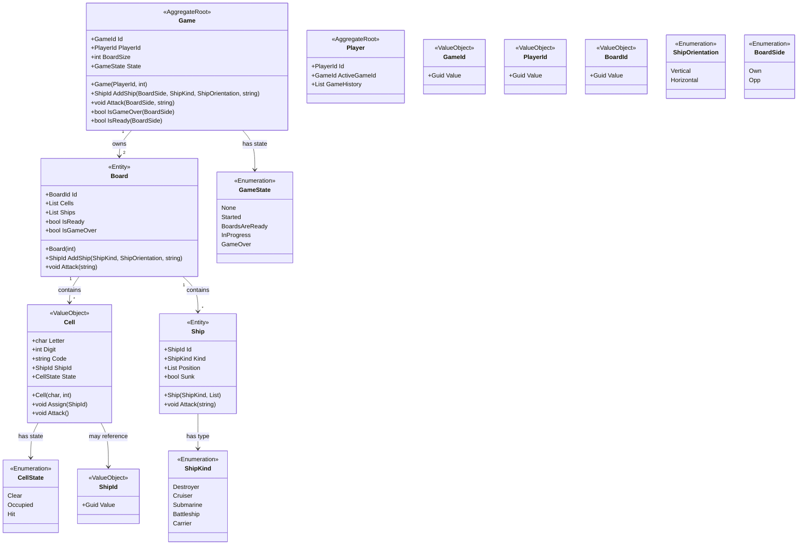
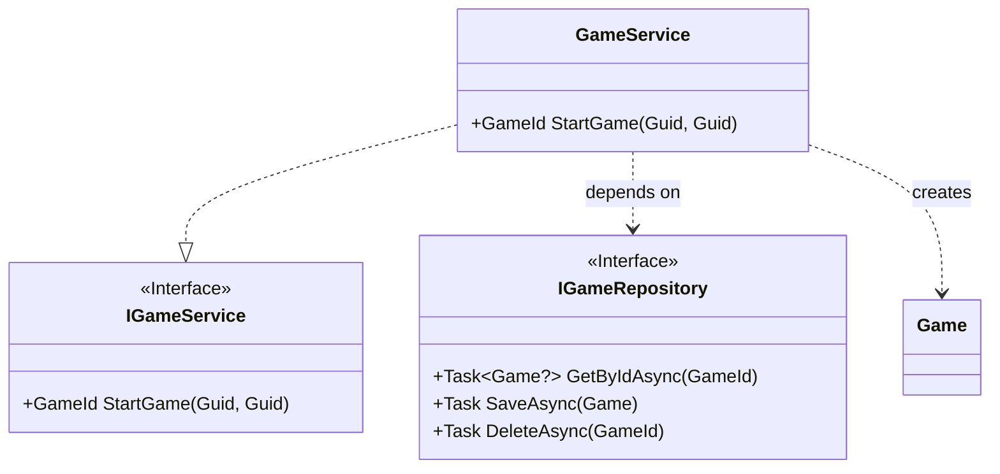
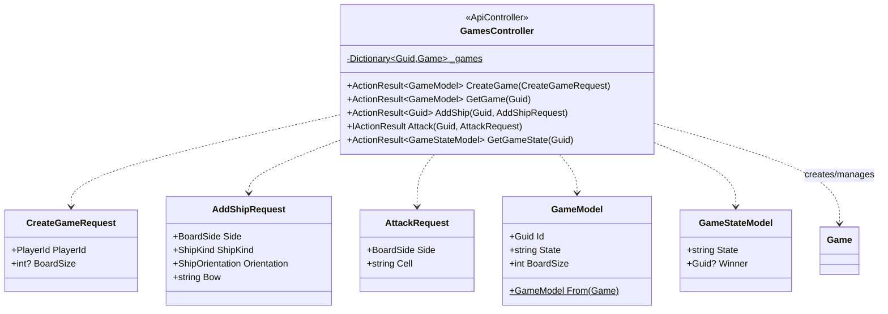

# Battleship Game - System Design

## Architecture Overview

This document outlines the system design for the Battleship game, following **Clean Architecture** principles with **Domain-Driven Design (DDD)** patterns.

## System Architecture

The application is structured in layers:

1. **Domain Layer** (`BattleshipGame/Domain`): Core business logic and domain models
2. **Application Layer** (`BattleshipGame/Application`): Application services and use cases
3. **Infrastructure Layer** (`BattleshipGame/Infrastructure`): Data access and external services
4. **Presentation Layer** (`BattleshipGame.WebAPI`): REST API controllers and DTOs

## Domain Model Class Diagram

## Application Layer Design

## Web API Layer Design

## Key Design Patterns

### Domain-Driven Design (DDD)
- **Aggregate Roots**: `Game` and `Player` manage consistency boundaries
- **Entities**: `Board` and `Ship` have identity and lifecycle
- **Value Objects**: `Cell` and strongly-typed IDs ensure immutability
- **Domain Events**: Enable decoupled communication

### Clean Architecture
- **Dependency Inversion**: Application layer depends on domain abstractions
- **Separation of Concerns**: Each layer has distinct responsibilities
- **Testability**: Domain logic isolated from infrastructure concerns

### SOLID Principles
- **Single Responsibility**: Each class has one reason to change
- **Open/Closed**: Extensible through interfaces and inheritance
- **Liskov Substitution**: Base classes properly extended
- **Interface Segregation**: Focused, cohesive interfaces
- **Dependency Inversion**: Depend on abstractions, not concretions

## Configuration and Constraints

### Board Configuration
- **Default Size**: 10x10 grid
- **Maximum Size**: 26x26 grid (A-Z columns, 1-26 rows)
- **Ship Allowance**: Exactly 5 ships per board

### Ship Configuration
- **Destroyer**: 2 cells
- **Submarine**: 3 cells
- **Cruiser**: 3 cells
- **Battleship**: 4 cells
- **Carrier**: 5 cells

### Game Rules
- Ships must be placed in straight lines (no diagonal)
- No overlapping ship positions
- Cannot attack the same cell twice
- Game ends when all ships on one board are sunk

## Error Handling Strategy

The system employs structured error handling:
- **Domain Exceptions**: Business rule violations throw appropriate exceptions
- **Validation**: Input validation at multiple layers
- **Error Messages**: Centralized error message management
- **API Responses**: Proper HTTP status codes and problem details
